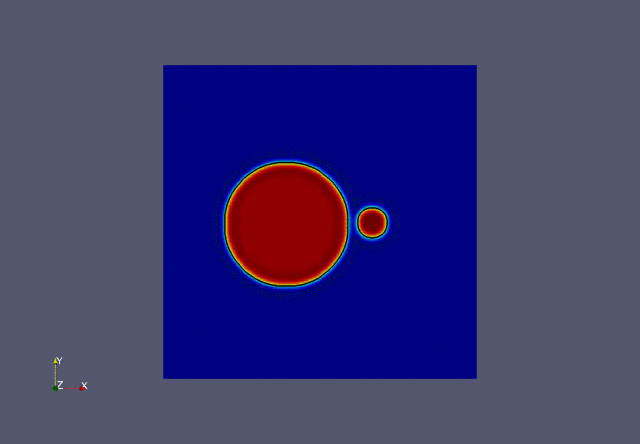



# PANPHILOS - PArallel PHase-fIeLd with palabOS

## Introduction

Phase-field modelling is a powerful computational tool to simulate phenomena such as solidification, precipitation, coarsening and Ostwald ripening. In this repository we collect all the classes, functions and algorithms to perform phase field simulatins on real 3D structures. 

##  Examples

### Ostwald ripening

## Installation
